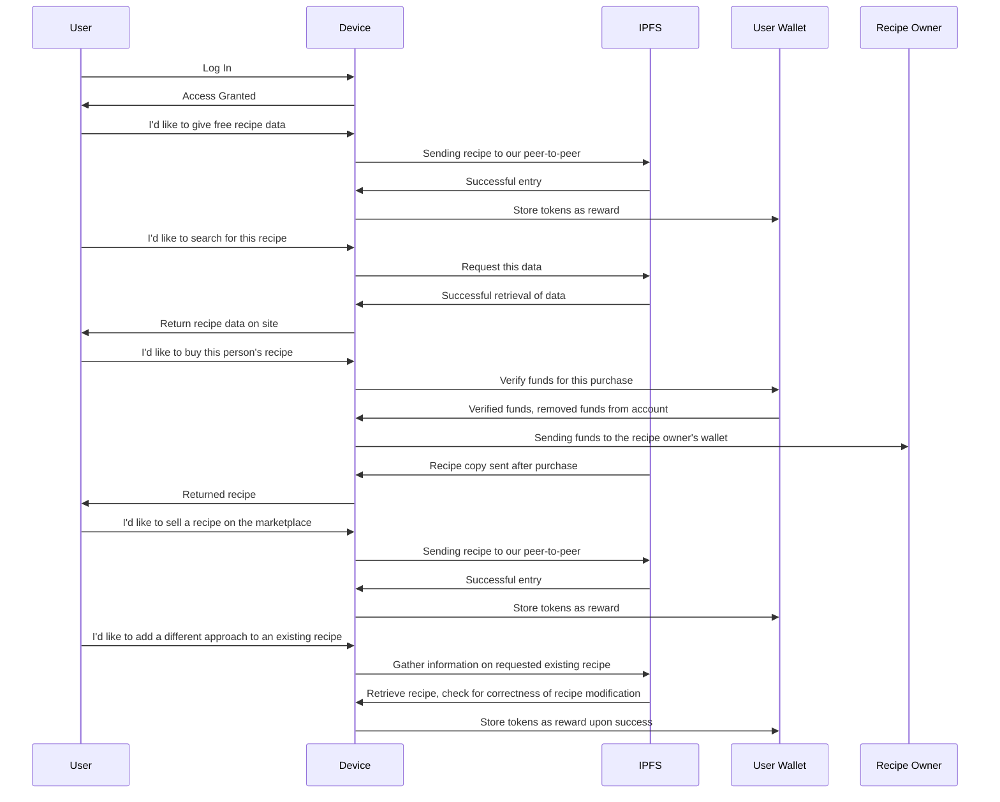

# Baked Bliss
Baked Bliss is a decentralized recipe marketplace app utilizing AI in order to ensure quality data hygiene and reliability by removing junk entries and giving recipe recommendations to users. Anybody is welcome to add to the collection of recipes for a token reward as an incentive to contribute. Users may be able to put a price tag on their entries in order to sell them on the marketplace to properly award them for their dish.

# Implementation & Stack
## Blockchain
We establish a Ethereum connection on our app and run our Solidity smart contracts for data entries, purchases, and selling of recipe data. User's data entries are uploaded to a peer-to-peer network using IPFS. Users may also request to modify an existing recipe, by adding a new version of the same title for people to view.
## AI
### User Recommendation System
We will train an AI model to make good recipe recommendations using a Matrix-Factorization Algorithm in listing users and their ratings/interactions of recipes as part of a matrix. Explicit data will be collected where Users can rate recipes they've viewed or purchased and use their viewing records on the IPFS system to process trustworthy data in training this model.
### Spam and Duplicate Detection
We will train an AI model to detect duplicate or similar recipes, as well as junk recipes to ensure quality of content. This will also help find similar recipes which can aid in the recommendation system.
## Web UI
The app is built on Flask for a lightweight framework capable of our development needs. Python allows for simple implementation on both frontend and our blockchain connection and smart contract execution using the Web3 api.

# Sequence Diagram

